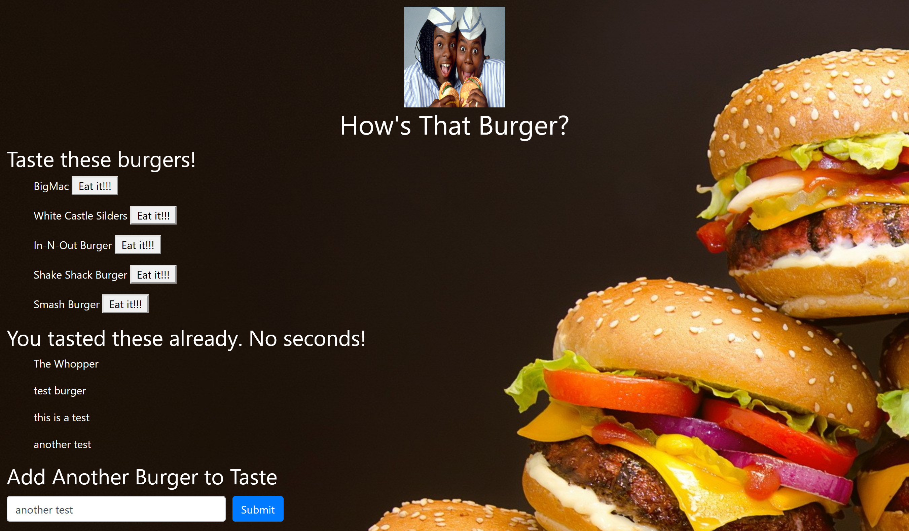

  # Eat The Burger
  
  ## Description
  This web app utilizes handlebars, mysql, and MVC file structure to track burgers that a user has already ate.
  ## Table of Contents
  1. [Description](#description)
  2. [Installation](#installation)
  3. [Usage](#usage)
  4. [License](#license)
  5. [Contributing](#contributing)
  6. [Tests](#tests)
  7. [Questions](#questions)
  ## Installation
  Visit the web application at https://mighty-garden-72717.herokuapp.com/ for use.
  ## Usage
  Click the "eat me" button next to a burger once you have tasted it and it will be moved to the already tasted section.
  ## License
  This app is covered under MIT licensing.
  ## Contributing
  Message this user on github for information on how to contribute to this app.
      
  ## Questions
  [GitHub](http://github.com/D-Brewst)  
